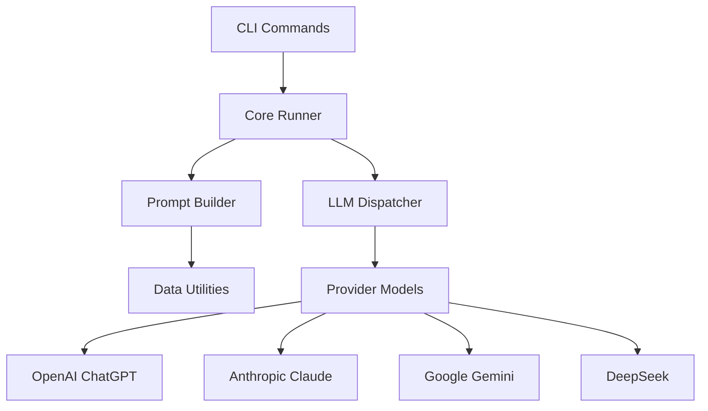

# 📚 Documentation

Comprehensive documentation for the LLM-MusicTheory toolkit.

## 🎯 Quick Navigation

| Document | Purpose | Audience |
|----------|---------|----------|
| **[../README.md](../README.md)** | Main project overview | All users |
| **[Architecture](#-architecture)** | System design | Developers |
| **[API Reference](#-api-reference)** | Code documentation | Developers |
| **[Best Practices](#-best-practices)** | Usage guidelines | All users |

## 🏗 Architecture

### System Overview

The LLM-MusicTheory toolkit follows a modular architecture with clean separation of concerns:



### Component Responsibilities

- **CLI Layer**: User interface and command parsing
- **Core Runner**: Orchestrates prompt execution workflow
- **Prompt Builder**: Assembles modular prompt components
- **LLM Dispatcher**: Routes requests to appropriate providers
- **Provider Models**: Abstract LLM provider implementations
- **Data Utilities**: File discovery and data loading

### Data Flow

1. **Input Processing**: CLI parses user arguments
2. **Resource Discovery**: System locates required files
3. **Prompt Assembly**: Builder combines modular components
4. **Model Selection**: Dispatcher initializes chosen LLM provider
5. **Execution**: Runner sends prompt and processes response
6. **Output Handling**: Response returned or saved to file

## 📖 API Reference

### Core Classes

#### `PromptRunner`

Central orchestrator for prompt execution.

```python
class PromptRunner:
    def __init__(
        self,
        model: LLMInterface,
        question_number: str,
        datatype: str,
        context: bool,
        **kwargs
    ):
        """Initialize with execution parameters."""
    
    def run(self) -> str:
        """Execute prompt and return LLM response."""
```

**Parameters:**
- `model`: LLM provider instance
- `question_number`: Question ID (e.g., "Q1b")
- `datatype`: Music format ("mei", "musicxml", "abc", "humdrum")
- `context`: Include contextual guides
- `temperature`: Sampling temperature (0.0-2.0)
- `max_tokens`: Response length limit
- `save`: Save response to file

#### `LLMInterface`

Abstract base for all LLM providers.

```python
class LLMInterface(ABC):
    @abstractmethod
    def query(self, input: PromptInput) -> str:
        """Send prompt to LLM and return response."""
```

#### `PromptBuilder`

Modular prompt composition system.

```python
class PromptBuilder:
    def build_prompt_input(
        self,
        question_number: str,
        datatype: str,
        context: bool,
        **kwargs
    ) -> PromptInput:
        """Build complete prompt from components."""
```

### Utility Functions

#### Path Utilities

```python
def find_project_root(start_path: Optional[Path] = None) -> Path:
    """Find project root by locating pyproject.toml."""

def list_datatypes(encoded_dir: Path) -> List[str]:
    """Return available music formats."""

def list_questions(questions_dir: Path) -> List[str]:
    """Return available question IDs."""
```

### CLI Commands

#### `run-single`

Execute single prompt with specified parameters.

```bash
poetry run run-single [OPTIONS]
```

**Options:**
- `--model {chatgpt,claude,gemini,deepseek}`: LLM provider (required)
- `--question TEXT`: Question ID (required)
- `--datatype {mei,musicxml,abc,humdrum}`: Music format (required)
- `--context`: Include context guides
- `--temperature FLOAT`: Sampling temperature
- `--max-tokens INTEGER`: Response length limit
- `--save`: Save response to file

#### `run-batch`

Execute multiple prompts automatically.

```bash
poetry run run-batch [OPTIONS]
```

**Options:**
- `--models TEXT`: Comma-separated list of models
- `--questions TEXT`: Comma-separated list of questions
- `--datatypes TEXT`: Comma-separated list of formats
- `--context`: Include context guides
- `--temperature FLOAT`: Sampling temperature

## ⚡ Best Practices

### Prompt Design

1. **Start Simple**: Test with basic prompts before adding complexity
2. **Use Context Wisely**: Context helps but increases token costs
3. **Temperature Control**: Use 0.0 for consistent results, higher for creativity
4. **Token Management**: Set max_tokens to control response length and costs

### Development

1. **Test First**: Run tests before making changes
2. **Mock APIs**: Never test with real API calls
3. **Environment Isolation**: Use Poetry virtual environments
4. **Type Hints**: Add type annotations for better IDE support

### Cost Management

1. **Start with DeepSeek**: Cheapest option for testing
2. **Use Free Tiers**: Google Gemini offers generous free tier
3. **Monitor Usage**: Check provider dashboards regularly
4. **Batch Wisely**: Use batch processing for efficient experiments

### File Organization

```
your-project/
├── outputs/                    # LLM responses (gitignored)
│   ├── ChatGPT/
│   ├── Claude/
│   └── ...
├── experiments/                # Your experimental setups
│   ├── experiment_1.py
│   └── results/
└── data/                      # Your custom data (optional)
    ├── custom_questions.txt
    └── custom_guides.txt
```

## � Advanced Usage

### Custom LLM Providers

Create new provider by extending `LLMInterface`:

```python
from llm_music_theory.models.base import LLMInterface, PromptInput

class CustomProvider(LLMInterface):
    def __init__(self, api_key: str):
        self.api_key = api_key
    
    def query(self, input: PromptInput) -> str:
        # Implement your API integration
        response = your_api_call(
            system=input.system_prompt,
            user=input.user_prompt,
            temperature=input.temperature
        )
        return response.text
```

### Custom Prompt Components

Extend prompt building with custom components:

```python
from llm_music_theory.prompts.prompt_builder import PromptBuilder

class CustomPromptBuilder(PromptBuilder):
    def add_custom_section(self, content: str) -> str:
        return f"\n## Custom Section\n{content}\n"
```

### Batch Experiments

Programmatic batch processing:

```python
from llm_music_theory.core.runner import PromptRunner
from llm_music_theory.core.dispatcher import get_llm

models = ["chatgpt", "claude", "deepseek"]
questions = ["Q1a", "Q1b", "Q2a"]
datatypes = ["mei", "musicxml"]

results = {}
for model_name in models:
    llm = get_llm(model_name)
    for question in questions:
        for datatype in datatypes:
            runner = PromptRunner(
                model=llm,
                question_number=question,
                datatype=datatype,
                context=True,
                save=True
            )
            response = runner.run()
            results[f"{model_name}_{question}_{datatype}"] = response
```

## 🚨 Troubleshooting

### Common Issues

**Q: Tests fail with "system prompt not found"**
A: This is expected for comprehensive tests when legacy data is incomplete. Core tests should pass.

**Q: ImportError for llm_music_theory module**
A: Ensure Poetry environment is active: `poetry shell` and `poetry install`

**Q: API key errors**
A: Check `.env` file format. No spaces around `=` sign.

**Q: High API costs**
A: Use DeepSeek or Google's free tier. Set `max_tokens` limits.

### Debug Mode

Enable verbose logging:

```python
import logging
logging.basicConfig(level=logging.DEBUG)
```

### Performance Tips

- Use `temperature=0.0` for reproducible results
- Set appropriate `max_tokens` to control costs
- Cache responses when experimenting
- Use batch processing for multiple queries

---

For more information, see the main [README.md](../README.md) or [examples/](../examples/) directory.

## 📖 Documentation Standards

### Writing Guidelines

1. **Clear Structure**: Use consistent headings and organization
2. **Code Examples**: Include runnable code snippets
3. **Cross-References**: Link between related documentation
4. **Version Information**: Note when features were added/changed
5. **Accessibility**: Use clear language and good formatting

### Markdown Standards

```markdown
# Main Title (H1)
## Section (H2)
### Subsection (H3)

- Use bullet points for lists
- **Bold** for emphasis
- `code` for inline code
- ```language for code blocks
```

### Code Documentation Standards

```python
def example_function(param1: str, param2: int = 0) -> str:
    """
    Brief description of what the function does.
    
    Args:
        param1: Description of first parameter
        param2: Description of second parameter with default
    
    Returns:
        Description of return value
    
    Raises:
        ValueError: When parameter validation fails
        
    Example:
        >>> result = example_function("hello", 42)
        >>> print(result)
        "hello: 42"
    """
    return f"{param1}: {param2}"
```

## 🚀 Documentation Roadmap

### Completed ✅
- [x] Main README with comprehensive setup
- [x] Basic project structure documentation
- [x] Test coverage documentation

### In Progress 🔄
- [ ] API reference generation with Sphinx
- [ ] User guide tutorials
- [ ] Architecture diagrams

### Planned 📋
- [ ] Video tutorials for common workflows
- [ ] Interactive examples with Jupyter notebooks
- [ ] Troubleshooting guides for common issues
- [ ] Advanced usage patterns and best practices

## 📝 Contributing to Documentation

### Quick Fixes
For small documentation fixes:
1. Edit the relevant `.md` file directly
2. Submit a pull request with your changes

### Major Documentation Changes
For significant documentation work:
1. Create an issue to discuss the changes
2. Fork the repository
3. Create a documentation branch
4. Make your changes following our style guide
5. Test the documentation builds successfully
6. Submit a pull request

### Documentation Issues
If you find documentation that is:
- Unclear or confusing
- Missing important information
- Contains errors or outdated information

Please [open an issue](https://github.com/liampond/LLM-MusicTheory/issues) with the label `documentation`.

## 🎯 Documentation Goals

1. **Accessibility**: Make the project approachable for new users
2. **Completeness**: Cover all features and use cases
3. **Accuracy**: Keep documentation in sync with code changes
4. **Discoverability**: Make it easy to find relevant information
5. **Maintainability**: Structure docs for easy updates

---

*Documentation last updated: January 2025*
